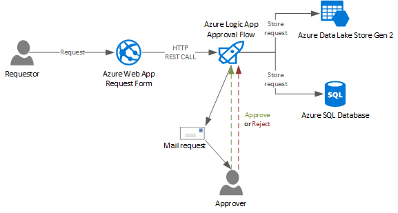
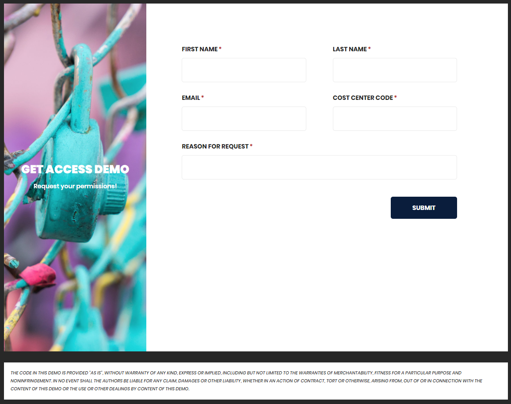
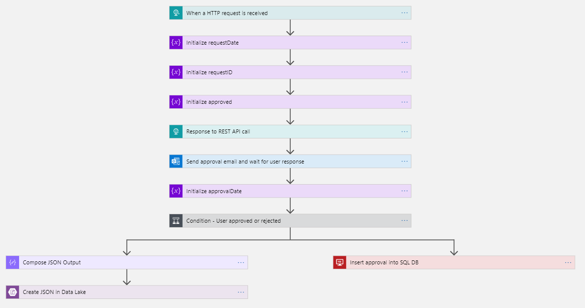

#  Demo - Logic App Approval Example Process

This repository contains a demo / example of a approval process backed by a Logic App. The idea is to have the possibility to quickly implement a approval process, for example for permission.

### The workflow

The idea is to have somebody request permissions, for example via a formular hosted in an Azure website, which will trigger a Logic App, which will start the approval process. This demo / example send the request via mail to an approver and write the request to after approval (or after the request was rejected) to a table in a Azure SQL Database and into an Azure Data Lake Store Gen 2 as a JSON.

## Screenshots

### The web form

### The Logic App flow

---

## :ambulance: Support Information

For further information about this project, how to [contribute](CONTRIBUTING.md), or how to contact me, please have a look at the [support document](SUPPORT.md) of this repository. It also contains information about [security related topics](SECURITY.md), [licensing](LICENSE.md), and more.  

## :man_judge: Disclaimer

THE CONTENT OF THIS REPOSITORY IS PROVIDED "AS IS", WITHOUT WARRANTY OF ANY KIND, EXPRESS OR IMPLIED, INCLUDING BUT NOT LIMITED TO THE WARRANTIES OF MERCHANTABILITY, FITNESS FOR A PARTICULAR PURPOSE AND NONINFRINGEMENT. IN NO EVENT SHALL THE AUTHORS BE LIABLE FOR ANY CLAIM, DAMAGES OR OTHER LIABILITY, WHETHER IN AN ACTION OF CONTRACT, TORT OR OTHERWISE, ARISING FROM, OUT OF OR IN CONNECTION WITH THE CONTENT OF THIS REPOSITORY OR THE USE OR OTHER DEALINGS BY CONTENT OF THIS REPOSITORY.