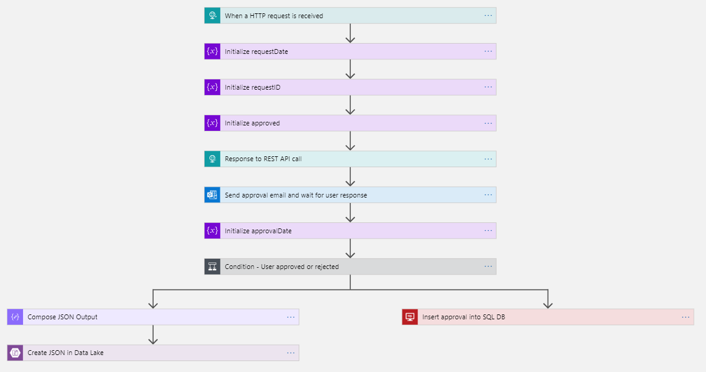

# The Logic App

This template JSON contains the logic app and can be deployed with Azure PowerShell, Cli, or Portal.
You can also use this Deploy to Azure Button.

>:exclamation: PLEASE CHECK THE CONNECTIONS IN THE LOGIC APP AFTER DEPLOYMENT IF THEY ARE CORRECT :exclamation:

